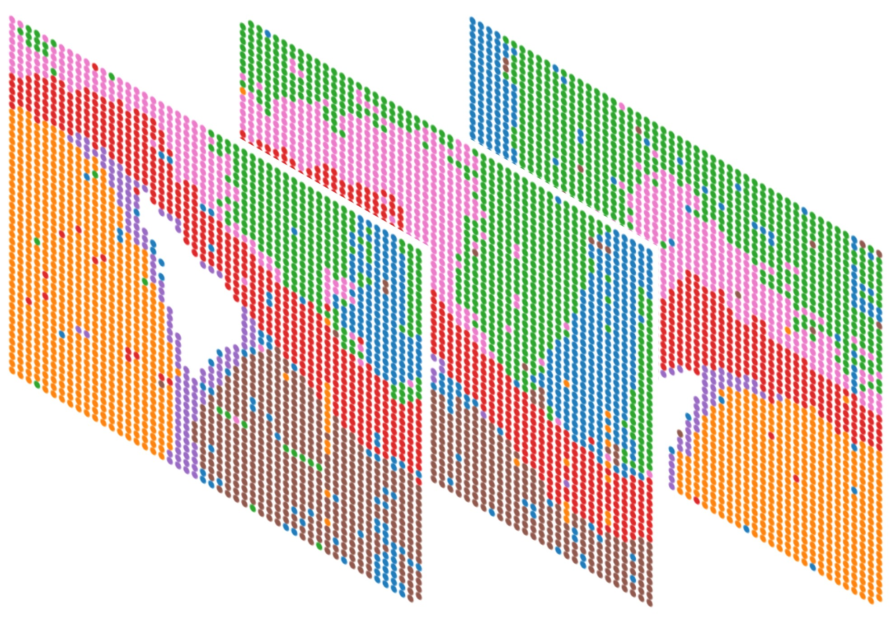
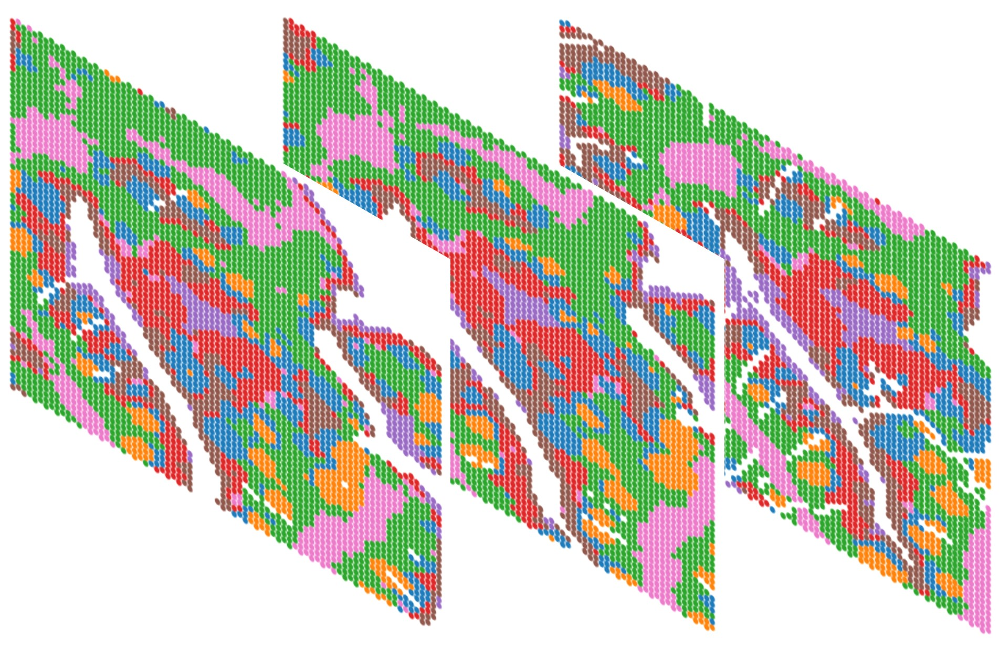

Horizontal Integration Tutorial
===============================

.. Horizontal Integration Tutorial

   `Integrate mouse brain sections in the RNA modality <horizontal/MB_RNA_horizontal_beta>`_

   `Integrate tonsil sections in the RNA modality <horizontal/Tonsil_horizontal_beta>`_

.. toctree::
   :maxdepth: 2
   :caption: horizontal integration
   :hidden:

   Tonsil_horizontal_beta
   MB_RNA_horizontal_beta
